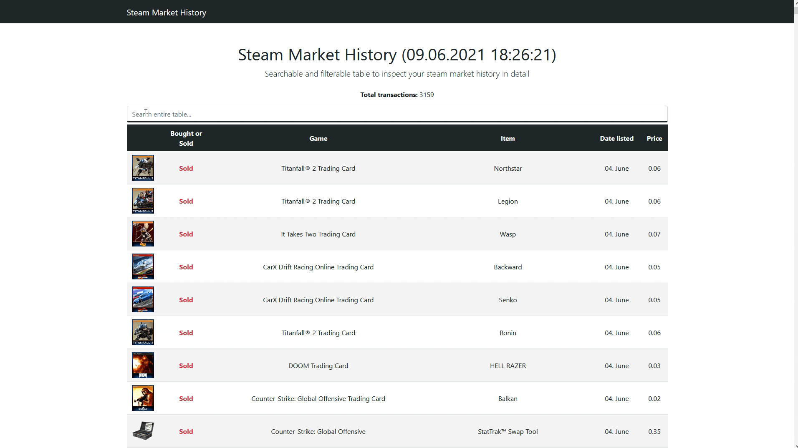

# Steam Market History Exporter

The Steam Market History Exporter is a command line tool written completly in Python which allows you to extract your entire Steam Market History with all transaction (sales/purchases) either in a reusable csv file, a styled and searchable HTML-File or both.



## Features

- Extract your **entire** Steam Market History
- Create a CSV-File with all transactions
- Overview of _all_ transactions on a user-friendly webpage
- Search _all_ transactions based on multiple values

## Requirements

- Python >= 3.6
- Pipenv: Python Development Workflow for Humans

## Installation

Clone this repo and navigate to its root direcory:

```bash
git clone https://github.com/fabieu/steam-market-history-exporter.git && cd ./steam-market-history-exporter
```

Run the following command to install all required dependencies:

```bash
pipenv install && pipenv shell
```

## Usage:

Run the tool by executing the following command:

```bash
pipenv run python generate.py {Options}
```

### Options:

For all available options check the cli command `pipenv run python generate.py --help`

- `--html` (Conditional (Required if `--csv` is not set): Generate HTML representation of your transactions in the `--target` folder (defaults to `./data`) and open it in your default browser
- `--csv` (Conditional (Required if `--html` is not set): Generate a CSV-File containing all your transactions in the root folder
- `--target` (Optional): Relative path based on script location for generated files (only .csv-files at the moment)

_When running the tool you will be prompted to insert your steam credentials. You can safely do this because all processing is done on your own computer. You can check this by looking at the public available source code._

## Licence

The MIT License (MIT)  
Copyright &copy; 2020-2021 Fabian Eulitz

Permission is hereby granted, free of charge, to any person obtaining a copy of this software and associated documentation files (the “Software”), to deal in the Software without restriction, including without limitation the rights to use, copy, modify, merge, publish, distribute, sublicense, and/or sell copies of the Software, and to permit persons to whom the Software is furnished to do so, subject to the following conditions:

The above copyright notice and this permission notice shall be included in all copies or substantial portions of the Software.

The software is provided “as is”, without warranty of any kind, express or implied, including but not limited to the warranties of merchantability, fitness for a particular purpose and noninfringement. In no event shall the authors or copyright holders be liable for any claim, damages or other liability, whether in an action of contract, tort or otherwise, arising from, out of or in connection with the software or the use or other dealings in the software.

&nbsp;

## Disclaimer:

**The Steam Market History Exported is a community project and is not affiliated with Valve or Steam.**
